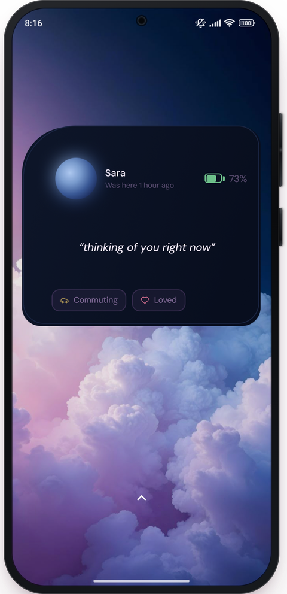
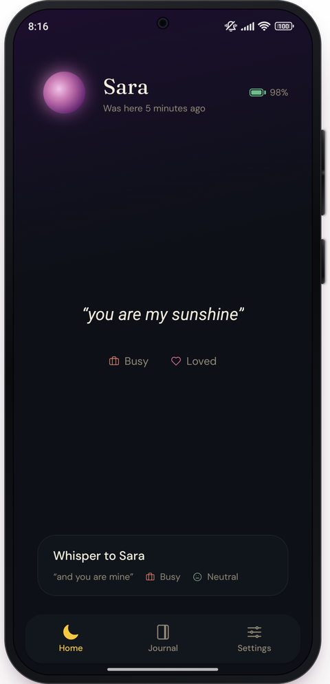
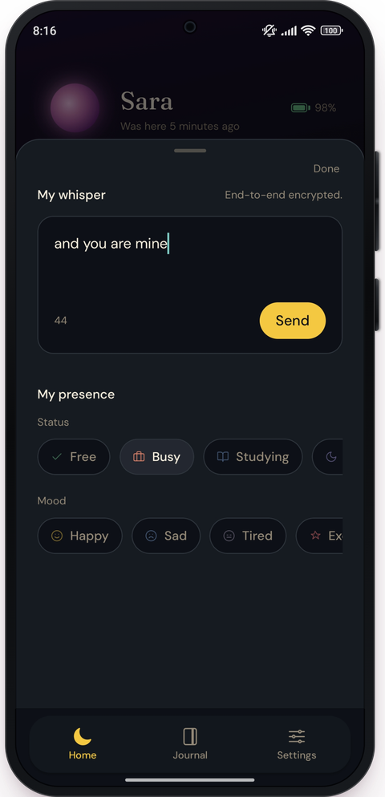

<div align="center">

# FusionFroze

[](https://luneapp.in)
[](https://www.npmjs.com/settings/fusionfroze/packages)

`[  ]`

</div>

<br>

## Currently building

**[Lune](https://luneapp.in)** — a mobile app that helps you connect with your partner in a unique, ambient, low-effort way. Find it on [Play Store](https://play.google.com/store/apps/details?id=com.fusionfroze.Lune).

[](https://play.google.com/store/apps/details?id=com.fusionfroze.Lune)
[](https://luneapp.in)

<p align="center">
  
  
  
</p>

## CLI Toolkit — `@fusionfroze` on npm

```
vault       # encrypt and store your secrets locally
stratify    # organize messy directories with a single command
squish      # compress PDFs locally
fset        # a simple workspace launcher
statsy      # see basic stats about npm packages maintained by you

$ npm i -g  @fusionfroze/<tool>
```

## Contact

`[ handles — send me these and I'll drop them in ]`

<div align="center">
<sub>Based in Kolkata, India</sub>
</div>
